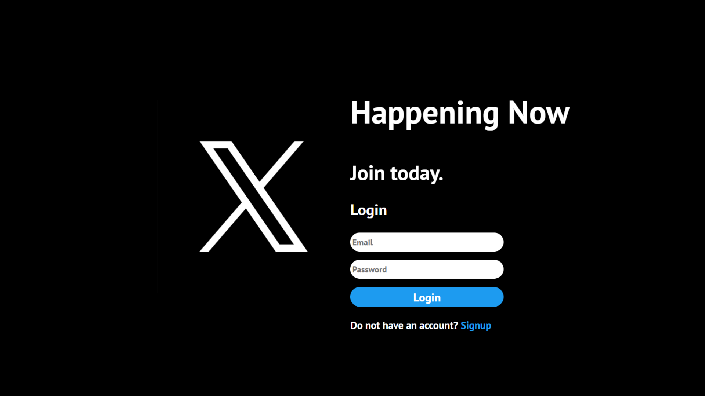
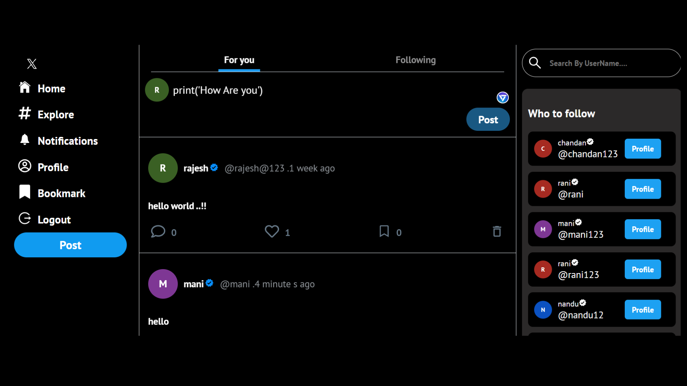

# Twitter Clone

## Overview
A full-stack Twitter clone built with the MERN stack, featuring secure authentication and user interactions.

## Features
- **Frontend**: Built with React.js for building user interfaces and Redux for state management.
- **Backend**: Developed using Node.js and Express.js for server-side logic, and MongoDB for data storage.
- **Authentication**: Implemented secure login and sign-up functionality using JWT tokens.
- **User Interactions**: Users can create, delete, like, and save posts; follow and unfollow users; view profile images; and manage basic user interactions.

## Screenshots





## Installation

### Prerequisites
- Node.js
- npm (Node Package Manager)
- MongoDB

### Frontend
1. Clone the repository:
    ```bash
    git clone https://github.com/yourusername/Twitter_Clone_frontend.git
    ```
2. Navigate to the project directory:
    ```bash
    cd Twitter_Clone_frontend
    ```
3. Install dependencies:
    ```bash
    npm install
    ```
4. Start the development server:
    ```bash
    npm start
    ```

### Backend
1. Clone the repository:
    ```bash
    git clone https://github.com/chandankumarm55/Twitter_Clone_backend.git
    ```
2. Navigate to the project directory:
    ```bash
    cd Twitter_Clone_backend
    ```
3. Install dependencies:
    ```bash
    npm install
    ```
4. Set up environment variables:
    - Create a `.env` file in the root directory.
    - Add the following environment variables:
        ```env
        PORT=5000
        MONGO_URI=your_mongo_database_uri
        JWT_SECRET=your_jwt_secret
        ```
5. Start the server:
    ```bash
    npm start
    ```

## Usage
1. Ensure MongoDB is running on your system.
2. Start the backend server.
3. Start the frontend development server.
4. Open your browser and navigate to `http://localhost:3000`.

## Contributing
Contributions are welcome! Please open an issue or submit a pull request for any changes.

## License
This project is licensed under the MIT License.
